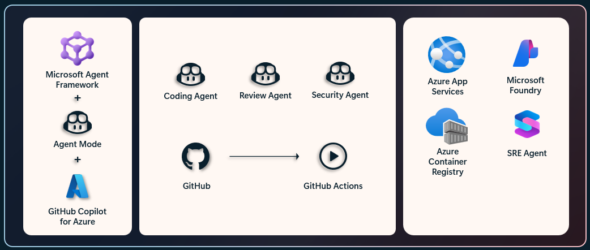

# Agentic DevOps Starter



A **hands-on guide project for practicing Agentic DevOps**. Walk through the entire process of building and deploying an AI agent-powered full-stack application to Azure.

> From Python based AI Agent development to AG-UI protocol integration, React frontend, IaC (Terraform), CI/CD (GitHub Actions), and Azure deployment — experience the full Agentic DevOps lifecycle in a single project.

## Overview

This repository provides a full-stack DevOps solution for deploying a Python-based AI agent application to Azure:

- **AI Agent**: Conversational AI agent built on Microsoft Agent Framework (`/app/src/agents`)
- **AG-UI Protocol**: Agent-User Interface integration with SSE streaming (`/app/agui_server.py`)
- **Frontend**: Chat UI built with React + TypeScript + CopilotKit (`/app/frontend`)
- **Backend**: FastAPI web server (`/app`)
- **Infrastructure**: Azure infrastructure provisioning with Terraform (`/infra`)
- **CI/CD**: Automated build and deployment via GitHub Actions (`.github/workflows`)
- **Specs & Plans**: Structured feature specifications and implementation plans (`/specs`)
- **Monitoring**: Integrated monitoring with Azure Log Analytics
- **Security**: HTTPS, Managed Identity, OIDC authentication

## Architecture

```
┌──────────────────────────────────────────┐
│         GitHub Actions CI/CD             │
│  Build → Push to ACR → Deploy           │
└──────────────────────────────────────────┘
                 ↓
┌──────────────────────────────────────────┐
│   Azure Container Registry (ACR)         │
└──────────────────────────────────────────┘
                 ↓
┌──────────────────────────────────────────┐
│       Azure App Service (HTTPS)          │
│  ┌────────────────────────────────────┐  │
│  │  Container (port 8080)             │  │
│  │  ┌──────────┐  ┌──────────┐       │  │
│  │  │  nginx   │→ │ Backend  │       │  │
│  │  │(frontend)│  │(FastAPI) │       │  │
│  │  └──────────┘  └──────────┘       │  │
│  │   Managed by supervisor            │  │
│  └────────────────────────────────────┘  │
│  System-Assigned Managed Identity        │
└──────────────────────────────────────────┘
                 ↓
┌──────────────────────────────────────────┐
│   Azure Log Analytics Workspace          │
└──────────────────────────────────────────┘
```

## Project Structure

```
agentic-devops-starter/
├── app/                          # Application code
│   ├── src/
│   │   ├── agents/               # AI agents (BaseAgent, ConversationalAgent)
│   │   ├── config/               # LLM configuration (Azure OpenAI / OpenAI)
│   │   └── logging_utils.py      # Structured logging
│   ├── frontend/                 # React + TypeScript chat UI
│   │   └── src/components/       # ChatInterface, ThemeSelector, etc.
│   ├── tests/                    # pytest-based tests
│   ├── agui_server.py            # AG-UI FastAPI server
│   ├── agui_client.py            # AG-UI CLI client
│   ├── main.py                   # CLI demo
│   ├── Dockerfile                # Development Docker
│   └── Dockerfile.appservice     # Azure App Service deployment Docker
├── infra/                        # Terraform IaC
│   ├── acr/                      # Azure Container Registry
│   ├── app-service/              # Azure App Service
│   ├── app-service-plan/         # App Service Plan
│   └── log-analytics/            # Log Analytics Workspace
├── specs/                        # Feature specifications & implementation plans
│   ├── 001-agent-framework/      # Agent Framework integration
│   ├── 002-ag-ui-integration/    # AG-UI protocol integration
│   ├── 003-copilotkit-frontend/  # CopilotKit frontend
│   └── 004-chat-theme-selector/  # Chat theme selector
├── .github/
│   ├── workflows/                # CI/CD (ci.yml, deploy.yml)
│   ├── skills/                   # Copilot Skills (git-commit, refactor)
│   └── agents/                   # GitHub Copilot Agent configuration
├── docs/                         # Additional documentation
└── init.sh                       # Development environment setup script
```

## Key Features

### AI Agent & AG-UI
- ✅ **Microsoft Agent Framework**: Conversational AI agent implementation
- ✅ **AG-UI Protocol**: Real-time streaming integration via SSE
- ✅ **Hybrid Tool Execution**: Client-side and server-side tool execution
- ✅ **Type Safety**: Type-safe with Pydantic models

### Frontend
- ✅ **React + TypeScript**: Chat UI powered by CopilotKit
- ✅ **Theme Selector**: Multiple chat theme support
- ✅ **Real-time Streaming**: Live responses via SSE

### Infrastructure & DevOps
- ✅ **Infrastructure as Code**: Reproducible Azure infrastructure with Terraform
- ✅ **Modern Python**: Fast, reliable dependency management with `uv`
- ✅ **Containerization**: Multi-stage Docker build with supervisor
- ✅ **CI/CD Automation**: Automated build and deployment via GitHub Actions
- ✅ **Built-in HTTPS**: Managed SSL/TLS certificates
- ✅ **Secure Auth**: OIDC-based Azure authentication + Managed Identity
- ✅ **Monitoring & Logging**: Azure Log Analytics integration
- ✅ **Auto-Scaling**: Built-in App Service scaling capabilities

## Quick Start

### 1. Set Up Development Environment

```bash
# Initialize environment (installs uv, Terraform)
./init.sh
source .venv/bin/activate
```

### 2. Provision Azure Infrastructure

```bash
cd infra
cp terraform.tfvars.example terraform.tfvars
# Edit terraform.tfvars with your values
# IMPORTANT: Change acr_name and app_service_name to globally unique values

terraform init
terraform apply

# Note outputs for GitHub Secrets
terraform output
```

See [`/infra/README.md`](./infra/README.md) for details.

### 3. Configure GitHub Actions

Set up OIDC authentication and configure secrets:

**Required Secrets:**
- `AZURE_CLIENT_ID`
- `AZURE_TENANT_ID`
- `AZURE_SUBSCRIPTION_ID`
- `ACR_NAME` (from terraform output)
- `APP_SERVICE_NAME` (from terraform output)
- `RESOURCE_GROUP` (from terraform output)

See [`docs/APPSERVICE_DEPLOYMENT.md`](./docs/APPSERVICE_DEPLOYMENT.md) for setup guide.

### 4. Deploy Application

```bash
git push origin main
```

Access at: `https://<app-service-name>.azurewebsites.net`

## Cost Estimation

Monthly costs (US East):

| Resource | Cost |
|----------|------|
| App Service Plan (P1v3) | ~$100 |
| ACR (Standard) | ~$20 |
| Log Analytics | ~$10-15 |
| **Total** | **~$130-135** |

**Estimated Total**: ~$130-135/month

## Documentation

- **[AG-UI Demo Guide](./app/AGUI_DEMO.md)**: How to run the AG-UI server and client
- **[Implementation Summary](./app/IMPLEMENTATION_SUMMARY.md)**: AG-UI integration details
- **[Backend API Docs](./app/README.md)**: Python Agent Framework application
- **[Frontend Docs](./app/frontend/README.md)**: React chat interface
- **[Infrastructure Setup](./infra/README.md)**: Terraform configuration
- **[Deployment Guide](./DEPLOYMENT.md)**: GitHub Actions deployment workflow
- **[Azure Setup](/.github/AZURE_SETUP.md)**: Azure OIDC authentication setup

### Specs

Detailed feature specifications are available in the `/specs` directory:

| Spec | Description |
|------|-------------|
| [001-agent-framework](./specs/001-agent-framework/) | Microsoft Agent Framework integration |
| [002-ag-ui-integration](./specs/002-ag-ui-integration/) | AG-UI protocol integration |
| [003-copilotkit-frontend](./specs/003-copilotkit-frontend/) | CopilotKit-based frontend |
| [004-chat-theme-selector](./specs/004-chat-theme-selector/) | Chat theme selector |

## Development

### Backend (AG-UI Server)
```bash
cd app
uv run agui_server.py
# AG-UI server: http://127.0.0.1:5100
# API docs: http://127.0.0.1:5100/docs
```

### Frontend
```bash
cd app/frontend
npm install
npm run dev
# Dev server: http://localhost:5173
```

### CLI Demo
```bash
cd app
uv run main.py
# CLI-based agent demo
```

### Test Combined Container
```bash
docker build -f app/Dockerfile.appservice -t test .
docker run -p 8080:8080 test
# http://localhost:8080
```

### Testing
```bash
cd app
uv run pytest tests/ -v
```

## Tech Stack

| Category | Technology |
|----------|-----------|
| **Language** | Python ≥3.12, TypeScript |
| **AI Framework** | Microsoft Agent Framework |
| **Backend** | FastAPI, Uvicorn |
| **Frontend** | React, CopilotKit, Tailwind CSS, Vite |
| **Protocol** | AG-UI (SSE Streaming) |
| **Package Manager** | uv (Python), npm (Node.js) |
| **IaC** | Terraform |
| **CI/CD** | GitHub Actions |
| **Cloud** | Azure (App Service, ACR, Log Analytics) |
| **Container** | Docker (multi-stage), nginx, supervisor |
| **Testing** | pytest, pytest-asyncio |
| **Linting** | ruff, ESLint |

## Troubleshooting

### View Logs
```bash
az webapp log tail --resource-group <rg> --name <app>
```

### Check Health
```bash
curl https://<app-service-name>.azurewebsites.net/health
```

See [DEPLOYMENT.md](./DEPLOYMENT.md) for detailed troubleshooting.

## Security

- ✅ HTTPS enforced by default
- ✅ Managed Identity (no stored credentials)
- ✅ Private ACR access
- ✅ Security headers configured
- ✅ Role-based access control

## Contributing

This project follows a spec-driven development approach. When adding a new feature, create a specification in the `/specs` directory before proceeding with implementation.

## License

See [LICENSE](./LICENSE) file.

## Support

For issues:
- Check documentation
- Review GitHub Actions logs
- Check Azure Portal
- View App Service logs
