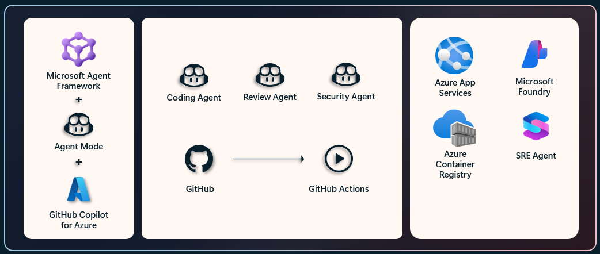

# Agentic DevOps Starter



A hands-on starter for building, running, and deploying an AI-powered full-stack
application with Agentic DevOps practices.

The project combines a **GitHub Copilot SDK** backend, **AG-UI SSE streaming**,
a **React + TypeScript** frontend, **Terraform-managed Azure infrastructure**,
and **GitHub Actions** CI/CD.

## Overview

| Area | Current implementation |
|------|------------------------|
| AI runtime | GitHub Copilot SDK sessions managed by a FastAPI backend |
| UI protocol | AG-UI-style Server-Sent Events (SSE) stream from `POST /` |
| Frontend | React 18, TypeScript, Vite, Zustand, Tailwind CSS |
| Agent patterns | Single chat, multi-turn conversation, Fleet, Infinite Session, and multi-agent teams |
| File uploads | Azure Blob Storage-backed uploads with size/type validation |
| Infrastructure | Azure App Service, ACR, Storage Account, VNet, Blob private endpoint, Log Analytics |
| Delivery | GitHub Actions CI and Azure App Service deployment with OIDC |

## Architecture

```text
Browser
  -> React/Vite frontend
  -> /api/* through Vite dev proxy or nginx production proxy
  -> FastAPI backend (:5100)
  -> GitHub Copilot SDK subprocess/session
  -> GitHub Copilot

Azure deployment:
GitHub Actions -> ACR -> Azure App Service container (:8080)
                             |-> nginx serves frontend and proxies /api/*
                             |-> FastAPI backend runs on :5100
                             |-> supervisor manages both processes
```

## Project Structure

```text
agentic-devops-starter/
├── app/
│   ├── agui_server.py              # FastAPI app factory and server entry point
│   ├── agui_client.py              # CLI smoke-test client
│   ├── src/
│   │   ├── routes.py               # AG-UI, upload, job, and team routes
│   │   ├── state.py                # Copilot SDK client/session pool
│   │   ├── jobs.py                 # Fleet and Infinite Session background jobs
│   │   ├── orchestrator.py         # Multi-agent team execution
│   │   ├── patterns.py             # Team pattern definitions
│   │   ├── blob_storage.py         # Azure Blob Storage integration
│   │   ├── file_validation.py      # Upload validation helpers
│   │   ├── config.py               # Pydantic settings
│   │   └── observability.py        # Optional Azure Monitor OpenTelemetry
│   ├── frontend/                   # React + TypeScript + Vite frontend
│   ├── tests/                      # pytest test suite
│   ├── pyproject.toml              # uv-managed Python project
│   ├── .env.example                # Local environment reference
│   └── Dockerfile.appservice       # Production App Service container
├── infra/
│   ├── main.tf                     # Terraform orchestration
│   ├── acr/                        # Azure Container Registry
│   ├── app-service/                # Linux Web App
│   ├── app-service-plan/           # App Service Plan
│   ├── log-analytics/              # Log Analytics Workspace
│   ├── network/                    # VNet and subnets
│   └── storage/                    # Blob Storage for uploads
├── specs/                          # Spec-driven development artifacts
├── docs/                           # Diagrams and historical notes
├── .github/workflows/              # CI and deployment workflows
└── DEPLOYMENT.md                   # Deployment workflow details
```

## Features

- **Streaming chat**: Browser chat UI streams assistant responses from FastAPI over SSE.
- **Multi-turn sessions**: Backend keeps Copilot SDK sessions alive per thread and cleans up idle sessions.
- **File attachments**: Frontend uploads supported files to Azure Blob Storage and sends blob references with prompts.
- **Agent teams**: Predefined collaboration patterns such as Debate & Critic, Generator & Evaluator, Leadership Discussion, Planner & Executor, and Research & Report.
- **Batch/loop workflows**: Fleet runs up to 20 prompts in parallel; Infinite Session chains outputs across iterations.
- **Production container**: Multi-stage Docker build serves frontend with nginx and runs FastAPI behind `/api/*`.
- **Azure IaC**: Terraform provisions App Service, ACR, Storage, private networking, and monitoring resources.
- **Secure deployment**: GitHub Actions uses Azure OIDC; App Service uses managed identity for ACR pull and Azure resource access.

## Prerequisites

- Python 3.12+
- [uv](https://docs.astral.sh/uv/)
- Node.js 20+ and npm 10+
- GitHub CLI (`gh`) authenticated with `gh auth login`
- Active GitHub Copilot entitlement for local development
- Terraform 1.5+ for Azure infrastructure
- Azure CLI for deployment troubleshooting and OIDC setup

## Local Development

### 1. Install backend dependencies

```bash
cd app
uv sync --frozen --all-extras
```

### 2. Configure local environment

```bash
cp .env.example .env
gh auth login
```

For local development, `GITHUB_TOKEN` is optional because the Copilot SDK can use
the authenticated GitHub CLI user. In production, set `GITHUB_TOKEN` from the
`COPILOT_GITHUB_TOKEN` GitHub Actions secret.

### 3. Start the backend

```bash
cd app
uv run agui_server.py
```

Backend URL: <http://127.0.0.1:5100>

### 4. Start the frontend

```bash
cd app/frontend
npm ci
npm run dev
```

Frontend URL: <http://localhost:8080>

The Vite dev server proxies `/api/*` to `http://127.0.0.1:5100` and strips the
`/api` prefix, matching production nginx behavior.

## API Surface

Backend routes are registered without an `/api` prefix. The prefix is added only
by frontend/proxy layers.

| Method | Path | Description |
|--------|------|-------------|
| `POST` | `/` | Chat SSE stream |
| `GET` | `/health` | Health check |
| `POST` | `/v1/files/upload` | Upload a validated file to Azure Blob Storage |
| `DELETE` | `/v1/threads/{thread_id}` | Disconnect and clean up a chat thread |
| `POST` | `/v1/threads/{thread_id}/abort` | Abort active chat or team generation |
| `POST` | `/v1/fleet` | Start a parallel prompt batch job |
| `POST` | `/v1/infinite-session` | Start chained reasoning iterations |
| `GET` | `/v1/patterns` | List available multi-agent team patterns |
| `POST` | `/v1/teams/stream` | Stream multi-agent team execution |
| `GET` | `/v1/jobs/{job_id}` | Poll async job status |
| `GET` | `/docs` | FastAPI OpenAPI UI |

## Environment Variables

| Variable | Required | Default | Description |
|----------|----------|---------|-------------|
| `GITHUB_TOKEN` | Production | unset | GitHub PAT with `copilot` scope for Copilot SDK authentication |
| `COPILOT_API_HOST` | No | `0.0.0.0` | Backend bind host |
| `COPILOT_API_PORT` | No | `5100` | Backend port |
| `COPILOT_API_LOG_LEVEL` | No | `INFO` | Backend log level |
| `COPILOT_API_SESSION_TIMEOUT` | No | `120.0` | Idle session timeout in seconds |
| `COPILOT_API_AZURE_STORAGE_BLOB_ENDPOINT` | File upload | unset | Blob endpoint, for example `https://<account>.blob.core.windows.net` |
| `COPILOT_API_AZURE_STORAGE_CONTAINER_NAME` | No | `uploads` | Upload container name |
| `COPILOT_API_SKILL_DIRECTORIES` | No | unset | Extra directories (`os.pathsep`- or comma-separated) scanned for Agent Skills (`SKILL.md`), in addition to built-in `app/skills/` |
| `COPILOT_API_DISABLED_SKILLS` | No | unset | Comma-separated skill names to disable |
| `APPLICATIONINSIGHTS_CONNECTION_STRING` | No | unset | Enables Azure Monitor OpenTelemetry export |
| `OTEL_SERVICE_NAME` | No | `agentic-devops-starter` | OpenTelemetry service name |
| `COPILOT_API_CLI_OTEL_ENDPOINT` | No | auto in App Service when App Insights is configured | GitHub Copilot CLI OTLP endpoint, typically `http://127.0.0.1:4318` for the local Collector companion process |
| `COPILOT_API_CLI_OTEL_CAPTURE_CONTENT` | No | `false` | Whether Copilot CLI telemetry captures prompt/response content |
| `VITE_AGUI_ENDPOINT` | No | `/api` | Frontend API base URL |

## Development Commands

Backend commands run from `app/`:

```bash
uv sync --frozen --all-extras
uv run agui_server.py
uv run ruff check .
uv run ruff format .
uv run mypy .
uv run pytest tests/ -v
```

Frontend commands run from `app/frontend/`:

```bash
npm ci
npm run dev
npm run build
npm run lint
npm run type-check
npm run test
npm run test:e2e
```

## Azure Infrastructure

Terraform lives in `infra/` and provisions:

- Resource group
- Azure Container Registry
- Linux App Service Plan
- Linux Web App with system-assigned managed identity
- Log Analytics Workspace
- Storage Account and uploads container
- VNet with App Service integration subnet
- Blob Storage private endpoint and private DNS zone

```bash
cd infra
cp terraform.tfvars.example terraform.tfvars
# Edit globally unique names: acr_name, app_service_name, storage_account_name

terraform init
terraform fmt -check
terraform validate
terraform plan
terraform apply
terraform output
```

Key outputs used by deployment are `acr_name`, `app_service_name`, and
`resource_group_name`.

## Deployment

Deployment uses `.github/workflows/deploy.yml`:

1. Build the combined frontend/backend image from `app/Dockerfile.appservice`.
2. Push both `${{ github.sha }}` and `latest` tags to ACR.
3. Set secret-based App Service settings.
4. Deploy the image to Azure App Service.
5. Verify `GET /health`.

Required GitHub Actions secrets:

| Secret | Description |
|--------|-------------|
| `AZURE_CLIENT_ID` | Azure OIDC app registration client ID |
| `AZURE_TENANT_ID` | Azure tenant ID |
| `AZURE_SUBSCRIPTION_ID` | Azure subscription ID |
| `ACR_NAME` | Azure Container Registry name |
| `APP_SERVICE_NAME` | App Service name |
| `RESOURCE_GROUP` | Resource group name |
| `COPILOT_GITHUB_TOKEN` | GitHub PAT with `copilot` scope |
| `AZURE_AI_PROJECT_ENDPOINT` | Azure AI Foundry endpoint for BYOK routing |
| `AZURE_AI_MODEL_DEPLOYMENT_NAME` | Azure AI Foundry model deployment name |
| `FOUNDRY_AUTH_MODE` | Foundry auth mode: `auto`, `api_key`, or `azure_identity` |
| `FOUNDRY_API_KEY` | Foundry API key, required only for `api_key` mode |
| `FOUNDRY_WIRE_API` | Foundry wire API: `responses` or `completions` |

See [DEPLOYMENT.md](./DEPLOYMENT.md) and [.github/AZURE_SETUP.md](./.github/AZURE_SETUP.md).

## CI

`.github/workflows/ci.yml` runs on pushes and pull requests to `main` and
`develop`:

```bash
cd app
uv sync --frozen --all-extras
uv run ruff check .
uv run pytest tests/ -v
```

## Specs

This repository follows spec-driven development. Existing specs:

| Spec | Description |
|------|-------------|
| [001-agent-framework](./specs/001-agent-framework/) | Initial agent framework integration |
| [002-ag-ui-integration](./specs/002-ag-ui-integration/) | AG-UI protocol integration |
| [003-copilotkit-frontend](./specs/003-copilotkit-frontend/) | React/CopilotKit frontend |
| [004-chat-theme-selector](./specs/004-chat-theme-selector/) | Chat theme selector |
| [005-multi-turn-conversation](./specs/005-multi-turn-conversation/) | Multi-turn conversation support |
| [006-github-copilot-sdk](./specs/006-github-copilot-sdk/) | GitHub Copilot SDK migration |
| [007-agent-team-platform](./specs/007-agent-team-platform/) | Multi-agent team platform |
| [008-blob-file-upload](./specs/008-blob-file-upload/) | Blob-backed file upload support |

## Troubleshooting

Check local backend health:

```bash
curl http://127.0.0.1:5100/health
```

Check deployed health:

```bash
curl https://<app-service-name>.azurewebsites.net/health
```

Tail App Service logs:

```bash
az webapp log tail --resource-group <resource-group> --name <app-service-name>
```

## Security Notes

- GitHub Actions authenticates to Azure with OIDC, not long-lived Azure credentials.
- App Service uses system-assigned managed identity for ACR pull and optional Azure AI role assignments.
- Production nginx adds common security headers and proxies only allowed HTTP methods.
- Blob upload storage is designed for managed identity and private endpoint access.
- Do not commit `.env`, Terraform state, secrets, or personal tokens.

## License

See [LICENSE](./LICENSE).
