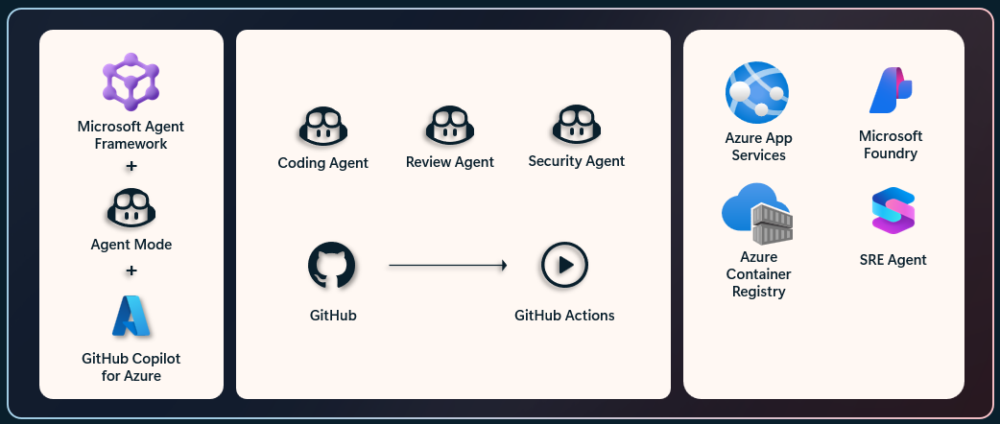

# Agentic DevOps Starter



A hands-on starter for building, running, and deploying an AI-powered full-stack
application with Agentic DevOps practices.

The project combines a **GitHub Copilot SDK** backend, **AG-UI SSE streaming**,
a **React + TypeScript** frontend, **Terraform-managed Azure infrastructure**,
and **GitHub Actions** CI/CD.

## Overview

| Area | Current implementation |
|------|------------------------|
| AI runtime | GitHub Copilot SDK sessions (default) or Azure AI Foundry BYOK sessions, managed by a FastAPI backend |
| UI protocol | AG-UI-style Server-Sent Events (SSE) stream from `POST /` or `POST /v1/byok/foundry` |
| Frontend | React 18, TypeScript, Vite, Zustand, Tailwind CSS |
| Agent patterns | Single chat, multi-turn conversation, Fleet, Infinite Session, and multi-agent teams |
| Tool calling | Built-in tools (`tools.py`) and optional remote MCP server (`mcp_client.py`) via `MCP_SERVER_URL` |
| File uploads | Azure Blob Storage-backed uploads with size/type validation |
| Infrastructure | Azure App Service, ACR, Storage Account, VNet, Blob private endpoint, Log Analytics |
| Delivery | GitHub Actions CI and Azure App Service deployment with OIDC |

## Architecture

```text
Browser
  -> React/Vite frontend
  -> /api/* through Vite dev proxy or nginx production proxy
  -> FastAPI backend (:5100)
  -> GitHub Copilot SDK subprocess/session
  -> GitHub Copilot

Azure deployment:
GitHub Actions -> ACR -> Azure App Service container (:8080)
                             |-> nginx serves frontend and proxies /api/*
                             |-> FastAPI backend runs on :5100
                             |-> OTel Collector sidecar runs on :4318 (Copilot CLI telemetry)
                             |-> supervisor manages all three processes
```

## Project Structure

```text
agentic-devops-starter/
├── app/
│   ├── agui_server.py              # FastAPI app factory and server entry point
│   ├── agui_client.py              # CLI smoke-test client
│   ├── src/
│   │   ├── api/                    # Routes, auth (OAuth), request/response models, SSE helpers
│   │   ├── core/                   # Pydantic settings, logging, observability
│   │   ├── runtime/                # Copilot client/session pool, jobs, skills, MCP client, tools, isolation
│   │   ├── storage/                # Azure Blob Storage and upload validation
│   │   └── teams/                  # Multi-agent team execution and pattern definitions
│   ├── frontend/                   # React + TypeScript + Vite frontend
│   ├── tests/                      # pytest test suite
│   ├── pyproject.toml              # uv-managed Python project
│   ├── .env.example                # Local environment reference
│   └── Dockerfile.appservice       # Production App Service container
├── infra/
│   ├── main.tf                     # Terraform orchestration
│   ├── acr/                        # Azure Container Registry
│   ├── app-service/                # Linux Web App
│   ├── app-service-plan/           # App Service Plan
│   ├── log-analytics/              # Log Analytics Workspace
│   ├── network/                    # VNet and subnets
│   └── storage/                    # Blob Storage for uploads
├── specs/                          # Spec-driven development artifacts
├── docs/                           # Diagrams and historical notes
├── .github/workflows/              # CI and deployment workflows
└── DEPLOYMENT.md                   # Deployment workflow details
```

## Features

- **Streaming chat**: Browser chat UI streams assistant responses from FastAPI over SSE.
- **GitHub App OAuth authentication**: On page load the frontend probes `GET /auth/session`; a 401 triggers a redirect to `GET /auth/login`, which starts the GitHub App OAuth flow. The returned user access token is encrypted with a Fernet cipher (PBKDF2-derived from the App client secret) and stored as an `httponly; secure; samesite=lax` session cookie valid for 8 hours.
- **Per-user session namespacing**: The decrypted GitHub token is hashed with AES-CMAC (second PBKDF2-derived key) to produce a stable, opaque user namespace. Combined with the optional `X-Isolation-Session-ID` header, this scopes Copilot SDK sessions per user.
- **Multi-turn sessions**: Backend keeps Copilot SDK sessions alive per thread and cleans up idle sessions.
- **Azure AI Foundry BYOK**: Alternative model routing via `POST /v1/byok/foundry` to Azure AI Foundry model deployments; select in the frontend model picker.
- **Tool calling**: Backend exposes built-in tools (`tools.py`) and optional remote MCP server integration (`mcp_client.py`); configure `MCP_SERVER_URL` to add external tools. Allowlist/denylist via `COPILOT_API_ALLOWED_TOOLS` and `COPILOT_API_EXCLUDED_TOOLS`.
- **File attachments**: Frontend uploads supported files to Azure Blob Storage and sends blob references with prompts.
- **Agent teams**: Predefined collaboration patterns such as Debate & Critic, Generator & Evaluator, Leadership Discussion, Planner & Executor, and Research & Report.
- **Batch/loop workflows**: Fleet runs up to 20 prompts in parallel; Infinite Session chains outputs across iterations.
- **Production container**: Multi-stage Docker build serves frontend with nginx, runs FastAPI behind `/api/*`, and forwards GitHub Copilot CLI telemetry through an OTel Collector sidecar.
- **Azure IaC**: Terraform provisions App Service, ACR, Storage, private networking, and monitoring resources.
- **Secure deployment**: GitHub Actions uses Azure OIDC; App Service uses managed identity for ACR pull and Azure resource access.

## Prerequisites

- Python 3.12+
- [uv](https://docs.astral.sh/uv/)
- Node.js 20+ and npm 10+
- GitHub CLI (`gh`) authenticated with `gh auth login`
- Active GitHub Copilot entitlement for local development
- Terraform 1.5+ for Azure infrastructure
- Azure CLI for deployment troubleshooting and OIDC setup

## Local Development

### 1. Install backend dependencies

```bash
cd app
uv sync --frozen --all-extras
```

### 2. Configure local environment

```bash
cp .env.example .env
```

Set `COPILOT_APP_CLIENT_ID` and `COPILOT_APP_CLIENT_SECRET` from your GitHub App settings.
Configure the GitHub App **Callback URL** (not the Webhook URL) to point to
`COPILOT_APP_REDIRECT_URI`; for local development use `http://localhost:8080/auth/callback`.
The production value is `https://app-agentic-devops.azurewebsites.net/auth/callback`.

> **How session auth works locally**: `COPILOT_APP_CLIENT_SECRET` is used both as the GitHub
> OAuth client secret and as a PBKDF2 passphrase to derive the Fernet key that encrypts the
> session cookie. Without it set, `GET /auth/login` returns HTTP 503 and `POST /` returns HTTP 401.

### 3. Start the backend

```bash
cd app
uv run agui_server.py
```

Backend URL: <http://127.0.0.1:5100>

### 4. Start the frontend

```bash
cd app/frontend
npm ci
npm run dev
```

Frontend URL: <http://localhost:8080>

The Vite dev server proxies `/api/*` to `http://127.0.0.1:5100` and strips the
`/api` prefix, matching production nginx behavior.

## API Surface

Backend routes are registered without an `/api` prefix. The prefix is added only
by frontend/proxy layers.

| Method | Path | Auth required | Description |
|--------|------|:---:|-------------|
| `POST` | `/` | ✓ | Chat SSE stream (GitHub Copilot) |
| `POST` | `/v1/byok/foundry` | — | Chat SSE stream (Azure AI Foundry BYOK); bypasses OAuth |
| `GET` | `/v1/models` | API key | List Copilot models via the Anthropic-compatible adapter |
| `POST` | `/v1/messages` | API key | Anthropic-compatible Messages API adapter backed by Copilot SDK |
| `GET` | `/auth/login` | — | Start GitHub App OAuth sign-in; redirects to GitHub |
| `GET` | `/auth/callback` | — | GitHub App OAuth callback; sets encrypted session cookie |
| `GET` | `/auth/session` | — | Returns `{"authenticated": true}` or HTTP 401; used as session probe |
| `POST` | `/auth/logout` | — | Deletes `github_oauth_session` cookie (HTTP 204) |
| `GET` | `/health` | — | Health check |
| `POST` | `/v1/files/upload` | — | Upload a validated file to Azure Blob Storage |
| `DELETE` | `/v1/threads/{thread_id}` | — | Disconnect and clean up a chat thread |
| `POST` | `/v1/threads/{thread_id}/abort` | — | Abort active chat or team generation |
| `POST` | `/v1/fleet` | — | Start a parallel prompt batch job |
| `POST` | `/v1/infinite-session` | — | Start chained reasoning iterations |
| `GET` | `/v1/patterns` | — | List available multi-agent team patterns |
| `POST` | `/v1/teams/stream` | — | Stream multi-agent team execution |
| `GET` | `/v1/jobs/{job_id}` | — | Poll async job status |
| `GET` | `/v1/mcp/tools` | — | List tools available from the remote MCP server |
| `GET` | `/docs` | — | FastAPI OpenAPI UI |

Auth is enforced by direct checks inside route handlers, not via FastAPI `Depends`. `POST /` reads and validates the `github_oauth_session` cookie; `/v1/models` and `/v1/messages` require `THIRDPARTY_API_KEY`; all other routes are currently unauthenticated at the route level.

## Environment Variables

| Variable | Required | Default | Description |
|----------|----------|---------|-------------|
| `COPILOT_APP_CLIENT_ID` | OAuth | unset | GitHub App client ID. Also accepted as `GITHUB_CLIENT_ID` |
| `COPILOT_APP_CLIENT_SECRET` | OAuth | unset | GitHub App client secret. **Dual use**: sent to GitHub in the token exchange AND used as PBKDF2 passphrase (600k iterations, SHA-256) to derive both the Fernet cookie-encryption key and the AES-CMAC session-namespace key. Also accepted as `GITHUB_CLIENT_SECRET` |
| `COPILOT_APP_REDIRECT_URI` | OAuth | unset | GitHub App callback URL. Local dev: `http://localhost:8080/auth/callback`. Production: `https://<app>.azurewebsites.net/auth/callback`. Also accepted as `GITHUB_OAUTH_REDIRECT_URI` |
| `COPILOT_API_HOST` | No | `0.0.0.0` | Backend bind host |
| `COPILOT_API_PORT` | No | `5100` | Backend port |
| `COPILOT_API_LOG_LEVEL` | No | `INFO` | Backend log level |
| `COPILOT_API_SESSION_TIMEOUT` | No | `120.0` | Idle session timeout in seconds |
| `COPILOT_API_ISOLATION_SESSION_HEADER` | No | `X-Isolation-Session-ID` | Header used to scope runtime and file isolation. When OAuth is active, combined with the per-user AES-CMAC namespace to form the final session pool key |
| `COPILOT_API_SESSION_CONFIG_ROOT_DIR` | No | `.copilot-session-config` | Base directory for per-isolation Copilot session config |
| `COPILOT_API_AZURE_STORAGE_BLOB_ENDPOINT` | File upload | unset | Blob endpoint, for example `https://<account>.blob.core.windows.net` |
| `COPILOT_API_AZURE_STORAGE_CONTAINER_NAME` | No | `uploads` | Upload container name |
| `COPILOT_API_SKILL_DIRECTORIES` | No | unset | Extra directories (`os.pathsep`- or comma-separated) scanned for Agent Skills (`SKILL.md`), in addition to built-in `app/skills/` |
| `COPILOT_API_DISABLED_SKILLS` | No | unset | Comma-separated skill names to disable |
| `APPLICATIONINSIGHTS_CONNECTION_STRING` | No | unset | Enables Azure Monitor OpenTelemetry export |
| `OTEL_SERVICE_NAME` | No | `agentic-devops-starter` | OpenTelemetry service name |
| `COPILOT_API_CLI_OTEL_ENDPOINT` | No | auto in App Service when App Insights is configured | GitHub Copilot CLI OTLP endpoint, typically `http://127.0.0.1:4318` for the local Collector companion process |
| `COPILOT_API_CLI_OTEL_CAPTURE_CONTENT` | No | `false` | Whether Copilot CLI telemetry captures prompt/response content |
| `COPILOT_API_APP_CONFIG_ENDPOINT` | No | unset | Azure App Configuration endpoint for feature flags (e.g. `https://<store>.azconfig.io`); loaded at startup with lower precedence than env vars |
| `COPILOT_API_APP_CONFIG_LABEL` | No | unset | Label filter applied when fetching from Azure App Configuration |
| `MCP_SERVER_URL` | No | unset | URL of the remote MCP server (e.g. `https://<name>.azurecontainerapps.io`); omit to run with built-in tools only |
| `COPILOT_API_TOOL_TIMEOUT` | No | unset | Timeout in seconds for individual tool calls |
| `COPILOT_API_ALLOWED_TOOLS` | No | unset | Comma-separated allowlist of tool names; overrides the denylist when set |
| `COPILOT_API_EXCLUDED_TOOLS` | No | unset | Comma-separated denylist of tool names to disable |
| `THIRDPARTY_API_KEY` | Yes (Anthropic) | unset | Shared API key required from `GET /v1/models` / `POST /v1/messages` callers via `Authorization` bearer token or `x-api-key` |
| `THIRDPARTY_GITHUB_PAT` | Yes (Anthropic) | unset | PAT used to authenticate the Copilot SDK session for `POST /v1/messages` |
| `VITE_AGUI_ENDPOINT` | No | `/api` | Frontend API base URL |

## Development Commands

Backend commands run from `app/`:

```bash
uv sync --frozen --all-extras
uv run agui_server.py
uv run ruff check .
uv run ruff format .
uv run mypy .
uv run pytest tests/ -v
```

Frontend commands run from `app/frontend/`:

```bash
npm ci
npm run dev
npm run build
npm run lint
npm run type-check
npm run test
npm run test:e2e
```

## Azure Infrastructure

Terraform lives in `infra/` and provisions:

- Resource group
- Azure Container Registry
- Linux App Service Plan
- Linux Web App with system-assigned managed identity
- Log Analytics Workspace
- Storage Account and uploads container
- VNet with App Service integration subnet
- Blob Storage private endpoint and private DNS zone

```bash
cd infra
cp terraform.tfvars.example terraform.tfvars
# Edit globally unique names: acr_name, app_service_name, storage_account_name

terraform init
terraform fmt -check
terraform validate
terraform plan
terraform apply
terraform output
```

Key outputs used by deployment are `acr_name`, `app_service_name`, and
`resource_group_name`.

## Deployment

Deployment uses `.github/workflows/deploy.yml`:

1. Build the combined frontend/backend image from `app/Dockerfile.appservice`.
2. Push both `${{ github.sha }}` and `latest` tags to ACR.
3. Set secret-based App Service settings.
4. Deploy the image to Azure App Service.
5. Verify `GET /health`.
6. Run Playwright E2E tests against the deployed URL.

Required GitHub Actions secrets:

| Secret | Description |
|--------|-------------|
| `AZURE_CLIENT_ID` | Azure OIDC app registration client ID |
| `AZURE_TENANT_ID` | Azure tenant ID |
| `AZURE_SUBSCRIPTION_ID` | Azure subscription ID |
| `ACR_NAME` | Azure Container Registry name |
| `APP_SERVICE_NAME` | App Service name |
| `RESOURCE_GROUP` | Resource group name |
| `COPILOT_APP_CLIENT_ID` | GitHub App client ID; injected as `GITHUB_CLIENT_ID` |
| `COPILOT_APP_CLIENT_SECRET` | GitHub App client secret; injected as `GITHUB_CLIENT_SECRET`. Used for OAuth token exchange and as PBKDF2 passphrase for cookie encryption |
| `AZURE_AI_PROJECT_ENDPOINT` | Azure AI Foundry endpoint for BYOK routing |
| `AZURE_AI_MODEL_DEPLOYMENT_NAME` | Azure AI Foundry model deployment name |
| `FOUNDRY_AUTH_MODE` | Foundry auth mode: `auto`, `api_key`, or `azure_identity` |
| `FOUNDRY_API_KEY` | Foundry API key, required only for `api_key` mode |
| `FOUNDRY_WIRE_API` | Foundry wire API: `responses` or `completions` |
| `APP_CONFIG_ENDPOINT` | Azure App Configuration endpoint; injected as `COPILOT_API_APP_CONFIG_ENDPOINT` |
| `APP_CONFIG_LABEL` | Azure App Configuration label filter; injected as `COPILOT_API_APP_CONFIG_LABEL` |
| `MCP_SERVER_URL` | Remote MCP server URL; injected as `MCP_SERVER_URL` |
| `APPLICATIONINSIGHTS_CONNECTION_STRING` | Enables Azure Monitor telemetry and starts the OTel Collector sidecar |
| `PLAYWRIGHT_GITHUB_TOKEN` | GitHub PAT used by E2E global-setup to forge a valid Fernet session cookie for smoke tests |
| `PLAYWRIGHT_GITHUB_CLIENT_SECRET` | Same value as `COPILOT_APP_CLIENT_SECRET`; used by E2E global-setup to replicate the PBKDF2+Fernet cookie cipher in Node.js |

See [DEPLOYMENT.md](./DEPLOYMENT.md) and [.github/AZURE_SETUP.md](./.github/AZURE_SETUP.md).

## CI

`.github/workflows/ci.yml` runs on pushes and pull requests to `main` and
`develop`:

```bash
cd app
uv sync --frozen --all-extras
uv run ruff check .
uv run pytest tests/ -v
```

## Specs

This repository follows spec-driven development. Existing specs:

| Spec | Description |
|------|-------------|
| [001-agent-framework](./specs/001-agent-framework/) | Initial agent framework integration |
| [002-ag-ui-integration](./specs/002-ag-ui-integration/) | AG-UI protocol integration |
| [003-copilotkit-frontend](./specs/003-copilotkit-frontend/) | React/CopilotKit frontend |
| [004-chat-theme-selector](./specs/004-chat-theme-selector/) | Chat theme selector |
| [005-multi-turn-conversation](./specs/005-multi-turn-conversation/) | Multi-turn conversation support |
| [006-github-copilot-sdk](./specs/006-github-copilot-sdk/) | GitHub Copilot SDK migration |
| [007-agent-team-platform](./specs/007-agent-team-platform/) | Multi-agent team platform |
| [008-blob-file-upload](./specs/008-blob-file-upload/) | Blob-backed file upload support |
| [009-refactor-patterns-yaml](./specs/009-refactor-patterns-yaml/) | Refactor team patterns into YAML-driven configuration |
| [010-tool-calling-integration](./specs/010-tool-calling-integration/) | Built-in and remote MCP tool calling integration |

## Troubleshooting

Check local backend health:

```bash
curl http://127.0.0.1:5100/health
```

Check deployed health:

```bash
curl https://<app-service-name>.azurewebsites.net/health
```

Tail App Service logs:

```bash
az webapp log tail --resource-group <resource-group> --name <app-service-name>
```

## Security Notes

- GitHub Actions authenticates to Azure with OIDC, not long-lived Azure credentials.
- App Service uses system-assigned managed identity for ACR pull and optional Azure AI role assignments.
- Production nginx adds common security headers and proxies only allowed HTTP methods.
- Blob upload storage is designed for managed identity and private endpoint access.
- The `github_oauth_session` cookie is `httponly; secure; samesite=lax` with an 8-hour TTL. The GitHub user access token is never exposed to JavaScript; it is stored only in the Fernet-encrypted cookie value.
- `COPILOT_APP_CLIENT_SECRET` is the PBKDF2 passphrase for both the session cookie cipher and the AES-CMAC session-namespace key. Rotating it invalidates all existing sessions.
- CSRF protection uses a server-side in-memory state store (`_oauth_states`); the state token is single-use and expires after 10 minutes. This is single-node only — multi-instance deployments need an external store.
- Do not commit `.env`, Terraform state, secrets, or personal tokens.

## License

See [LICENSE](./LICENSE).
